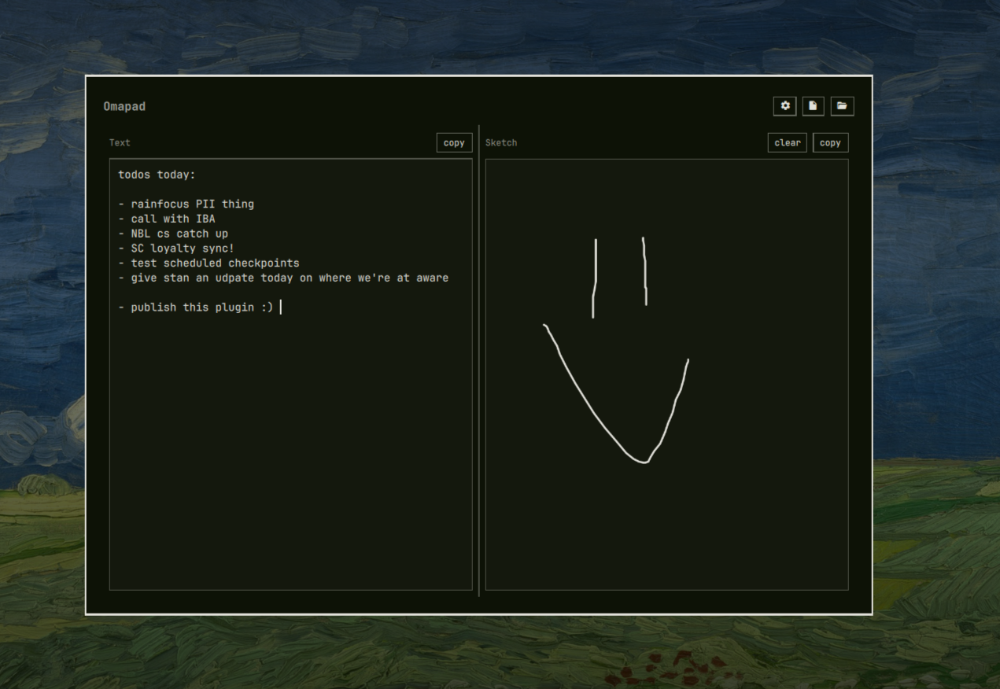

# Omapad



A lightning-fast scratchpad overlay for [Omarchy](https://github.com/basecamp/omarchy). One keystroke to summon, one to hide. Text on the left, freehand sketch on the right. Both persist to disk.

## Install

```sh
omarchy plugin add https://github.com/jamespember/omapad.git --enable
```

Add a binding in `~/.config/hypr/bindings.lua`:

```lua
o.bind("SUPER + N", "Omapad", "omarchy-shell shell toggle io.github.jamespember.omapad '{}'")
```

Reload with `hyprctl reload`.

## Use

| Keys | Action |
|------|--------|
| `Super+N` | Toggle overlay |
| `Esc` | Hide |
| `Ctrl+Shift+C` | Copy text |
| `Ctrl+Shift+S` | Copy sketch as PNG |
| `Ctrl+Z` (sketch) | Undo stroke |

Title-row icons: cog (settings) · file (open in editor) · folder (open location).

## Configure

Hit the cog to edit settings in-app, or edit `~/.config/omarchy/shell.json` directly:

| Key | Default | |
|-----|---------|---|
| `notePath` | `~/.local/state/omapad/note.txt` | Where the text pane persists |
| `openCommand` | `["uwsm-app", "--", "omawrite", "{path}"]` | Command for the "open file" button |

`{path}` → absolute path. `{pathUri}` → URI-encoded path.

Preset chips in the settings pane cover Omawrite, Obsidian, VS Code, Neovim (in the user's terminal), and System (`xdg-open`).

Sketches always live locally at `~/.local/state/omapad/sketch.json` — not synced. Copy the PNG when you want one elsewhere.

## Remove

```sh
omarchy plugin remove io.github.jamespember.omapad
```

## Hacking

The plugin's `keepLoaded: true` — QML file changes trigger a manifest rescan but don't re-instantiate the overlay. During development, restart the shell to pick up structural changes:

```sh
omarchy-restart-shell
```

## License

MIT — see [LICENSE](LICENSE).
